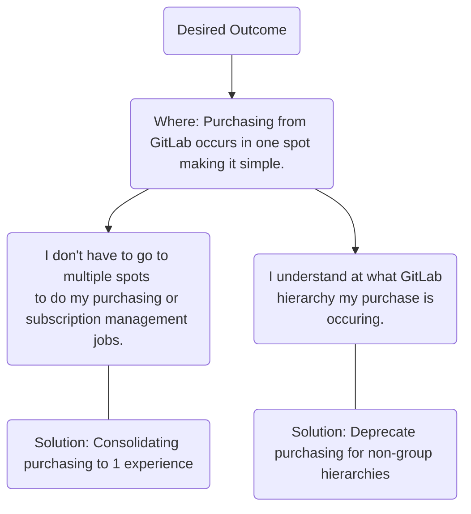
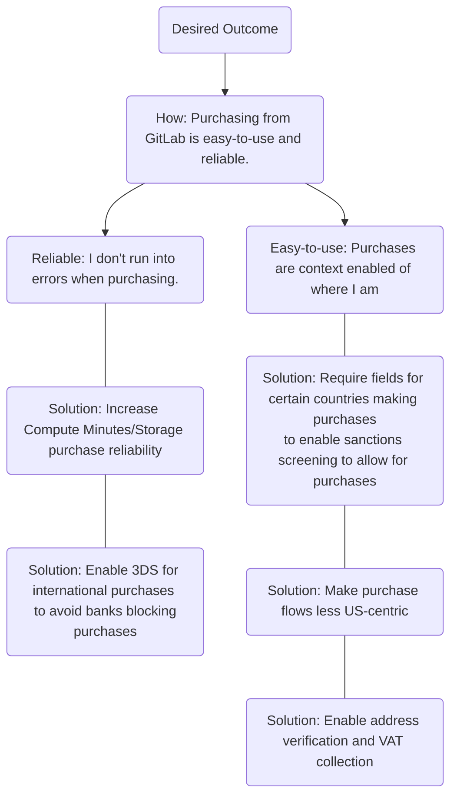
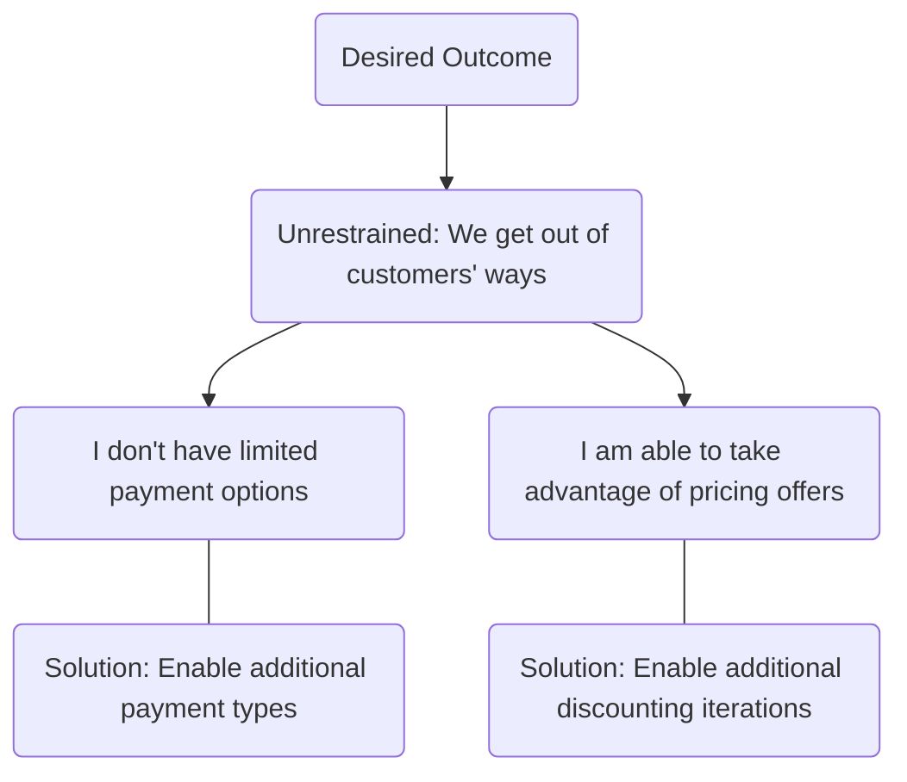

## On this page
{:.no_toc .hidden-md .hidden-lg}

- TOC
{:toc}

<link rel="stylesheet" type="text/css" href="/stylesheets/biztech.css" />

Last reviewed: 2023-07

## Fulfillment: Purchase Overview

Purchase, a [Fulfillment](https://about.gitlab.com/direction/fulfillment/) subgroup, is responsible for our primary e-commerce experience, with the goal of increasing the number of first-orders we receive through our self-service purchase flow and in turn, reducing the need for a GitLab team member to manually intervene. The team is also [temporarily overseeing](https://gitlab.com/gitlab-org/fulfillment-meta/-/issues/1131) work related to seat cost management: seat usage visibility, billable users calculation, and seat limits.

## Vision, Mission, Strategy, and Outcomes

|   | **What does it mean?** | **What does it look like for the Purchase group?** |
| :---- | :----------------- | :----------------- | 
| **Mission** | Our problem space: what is the mountain we're trying to climb? | Purchasing and understanding seat usage GitLab online should be flexible, asynchronous enabled, and transparent. |
| **Vision** | Our solution concept: what will it look like at the top of the mountain? | Provide a simple, easy-to-use, and reliable purchase experience: we get out of customers' way and get them back to quickly adopting GitLab. |
| **Strategy** | How we'll do it: what is the route we'll take up the mountain? | 1. **Enable pricing and packaging innovation at GitLab**: Ensure our purchasing & seat usage functionality supports P&P innovations.   2. **Minimize our Footprint**: What can we consolidate? What features and flows should we stop supporting?   3. **Improve Existing Experience**: What have customers, sales, and support told us are the problems with our existing experience?   4. **Become a Human**: What are the gaps between our online purchasing experience and our direct channel? What features bring us to parity? _Note: this [does not mean we will build everything](https://about.gitlab.com/direction/fulfillment/purchase/#work-were-not-doing) that a human can do._   5. **Business Necessary Support**: Additionally, due to the nature of building global commerce functionality, our team will also need to support compliance, legal, and tax related efforts to safeguard revenue and meet regulations.  |
| **Outcomes** | How we'll know we've achieved our vision: what signs tell us we've reached the top of the mountain? | Find our previous performance indicators [here](https://internal.gitlab.com/handbook/company/performance-indicators/product/fulfillment-section/).  |

## Feature Overview and Maturity

_What features is the Purchase group responsible for and how mature are they?_

**Legend:**
- 🙂 **Minimal**: Available and works for a small number of use cases. Some transparency for internal teams.
- 😊 **Viable**: Available and works for majority of use cases. Some transparency for internal teams.
- 😁 **Complete**: Fully functional for all eligible use cases. Full transparency for internal teams.
- 😍 **Lovable**: Glowing review from external and internal users.

|Category| Feature | Maturity | Description | 
|---------|---------|:--------:|-------------|
|Purchase | SM Web-Direct First Order | 😊 Viable | First time purchases for our Self-Managed seats. Currently takes place on customers.gitlab.com. |
|Purchase | SaaS Web-Direct First Order | 😊 Viable | First time purchases for our SaaS seats. Currently takes place on gitlab.com. |
|Purchase | Purchase compute minutes | 😊 Viable | All (first time, add-on) for compute minutes. Currently takes place on gitlab.com for group namespaces, and on customers.gitlab.com for personal namespaces. |
|Purchase | Purchase Storage | 😊 Viable | All (first time, add-on) for Storage. Currently takes place on customers.gitlab.com and gitlab.com. |
|Purchase | Community Programs - sign up | 😊 Viable | Complimentary subscriptions to GitLab Ultimate for [program participants](https://about.gitlab.com/handbook/marketing/developer-relations/community-programs/#meet-the-programs). |
|Seat Cost Management | Seat Usage Visibility | 😊 Viable | Customers understand how many seats are being used and by whom |
|Seat Cost Management| Billable Users Calculation | 🙂 Minimal | Customers understand how many billable seats are being used, by whom, and when they are being used |
|Seat Cost Management| Seat Limits | 😊 Viable | Customers understand if they are within the user limits threshold and how to take action (remove, add more, set seat limits) |

## Opportunities 

### Sensing Mechanisms
_What is informing the pain points we are trying to solve and the resulting roadmap?_

- See the purchase team's sensing mechanisms [here](https://drive.google.com/drive/search?q=type:spreadsheet%20owner:Alex%20Martin%20Fulfillment%20Purchase%20Direction%20Sensing%20Mechanisms).

### Opportunity Mapping

_Learn more about opportunity mapping [here](https://www.producttalk.org/2020/07/opportunity-mapping/)._

**Desired Outcome**: achieve purchase vision of providing a simple, easy-to-use, and reliable purchase experience:  we get out of customers' way and get them back to quickly adopting GitLab that drives our [performance indicators](https://internal.gitlab.com/handbook/company/performance-indicators/product/fulfillment-section/).
{: .alert .alert-success}

## 1-year Plan

_Where are we focused over the next 12 months to make meaningful steps towards achieving our vision and increasing feature maturity?_

### 1-year Vision

In a year from now, we hope to have:

1. Support the evolution of our new product offerings to ensure they can be monetized online

### Roadmap

_What are we building this quarter?_

- [FY'24 Q3 OKRs (Not Public)](https://gitlab.com/gitlab-com/gitlab-OKRs/-/work_items/3241) 

**Legend**
- Type:
   - 💪 **Strategic**: Work that executes upon our strategy and drives our outcomes to achieve our vision
   - 🙌 **Business Supporting**: Work doesn't necessarily map to our strategy but is business necessary. 

| What is the work to do?  | Type | What strategy are we envoking? | What feature(s) will this work help mature? | What outcomes will this work impact? |
|---------|:------:|--------|-------------|-------------|
| Enable [pricing & packaging advancements](https://gitlab.com/groups/gitlab-org/-/epics/10336) | 💪 | **Strategic** to support monetization of our product | 1. Purchase add-ons | Add-on purchases | 

### Possible Future Opportunities

_What other work are we considering to include in our roadmap but is not yet planned?_

- [FY24 Fulfillment Plans & Prioritization](https://gitlab.com/gitlab-com/Product/-/issues/5291) (Not Public)

| What is the work to do? | Why are we considering it? | 
|---------|--------|
| 1st iteration of [seat usage tracking and reporing](https://gitlab.com/groups/gitlab-org/-/epics/10314)  | **Improve existing experience** via fixing our biggest pain point of our support team resulting in a decrease support tickets related to max seat users | 
| [Support '3D Secure' (3DS) authentication for credit card payments from India and Europe](https://gitlab.com/gitlab-org/customers-gitlab-com/-/issues/3811) | **Improve existing experience** via fixing our biggest pain point of our support team |
|[Minimize unecessary purchase flows for personal namespaces](https://gitlab.com/groups/gitlab-org/-/epics/9168) | **Minimize our footprint** via ending supporting to low utilized flows while increasing maturity for compute minutes / Storage |
| 2nd iteration of online discounting | **Become a Human** via enhancing online discounting functionality |
| [Address Validation](https://gitlab.com/groups/gitlab-org/-/epics/9637) | **Business necessary support**: Safeguard revenue through implementing compliance measures |
|[VAT](https://gitlab.com/groups/gitlab-org/-/epics/9709)|**Business necessary support**: Safeguard revenue through implementing compliance measures |
|[Consolidate purchase flows](https://gitlab.com/groups/gitlab-org/-/epics/9569) from 2 (CustomersDot and gitlab.com) to 1|**Minimize our footprint** via not having to maintain purchasing flows on GitLab.com and CustomersDot an allowing us to increase developer productivity |
| [Evaluate Purchase Flows for Global Inclusiveness](https://gitlab.com/groups/gitlab-org/-/epics/9525) | **Improve existing experience** In order to make our experience less US-centric |
| Support additional payment types | **Become a Human** via allowing for multiple payment methods; something that can only be achieved via the direct/partner channel today |

### This Year's Prior Work
- [FY'24 Q1 Fulfillment OKRs (Not Public)](https://gitlab.com/gitlab-com/gitlab-OKRs/-/work_items/695)
- [FY'24 Q2 Fulfillment OKRs (Not Public)](https://gitlab.com/gitlab-com/gitlab-OKRs/-/work_items/1736?iid_path=true)

| What was the work to do?  | Type | What strategy did we envoke? | What feature(s) did this work help mature? | What outcomes did this work impact? |
|---------|:------:|--------|-------------|-------------|
| [Enable online discounting](https://gitlab.com/groups/gitlab-org/-/epics/9019)  | 💪 | **Become a Human** via allowing for online discounting; something that can only be achieved via the direct/partner channel today | SaaS Web-Direct First Order | Increase count of SMB FO transactions through self-service  | 
|[Unify naming conventions for compute purchase flows](https://gitlab.com/groups/gitlab-org/-/epics/9503)| 🙌 |**Business necessary support** to support monetization of our product | SaaS Compute Minutes | N/A |

### Work We're Not Doing

**Become a Human**: list of functionality that non-online channels offer that we do not plan on building. List may not be exhaustive.
- Custom terms
- Multi-year deals

## Key Links

- Roadmap
   - [FY'24 Q3 OKRs](https://gitlab.com/gitlab-com/gitlab-OKRs/-/work_items/3241) (Not Public)
   - We also have [Fulfillment FY24 Plans and Prioritization](https://gitlab.com/gitlab-com/Product/-/issues/5291) (Not Public), that internal team members can reference to track all planned initiatives by theme.
- [Internal Handbook Page](https://internal.gitlab.com/handbook/product/fulfillment/self-service-purchase/)
- [Prior Performance Indicators](https://internal.gitlab.com/handbook/company/performance-indicators/product/fulfillment-section/)
- Purchase flow documentation can be found [here](https://gitlab.com/gitlab-org/fulfillment-meta/-/issues/1430).
