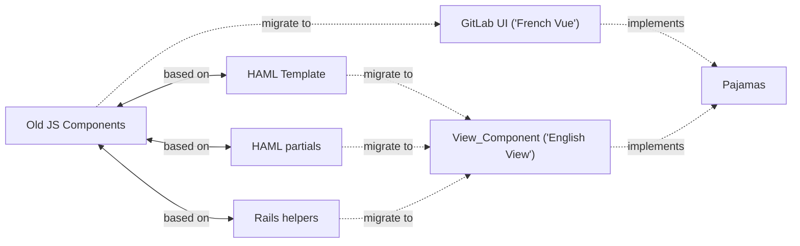

- TOC
{:toc}

|                       |                               |
| -                     | -                             |
| **Stage** | [Manage](/direction/manage/) |
| **Maturity** | [Viable](/direction/maturity/) |
| **Last reviewed** | `2023-08-11` |

Thanks for visiting this direction page on the Design System category in GitLab. This page belongs to the [Foundations Group](https://about.gitlab.com/handbook/product/categories/#foundations-group) within the Manage Stage and is maintained by [Christen Dybenko](mailto:cdybenko@gitlab.com).

This direction is constantly evolving and everyone can contribute:

- Please comment and contribute in the linked [issues](https://gitlab.com/groups/gitlab-org/-/issues/?sort=weight&state=opened&label_name%5B%5D=Category%3ADesign%20System&first_page_size=20) and [epics](https://gitlab.com/groups/gitlab-org/-/epics?state=opened&page=1&sort=start_date_desc&label_name[]=Category:Design+System) on this page. Sharing your feedback directly on GitLab.com or submitting a merge request to this page are the best ways to contribute to our strategy.
- Please share feedback directly via email, Twitter, or [schedule a video call](https://calendly.com/cdybenko-gitlab/meeting-30). If you're contributing to the GitLab Design System, we'd especially love to hear from you.

## Overview

Our goal with the Design System category is to treat the underlying foundation of GitLab as a first-class internal product which supports product designers, engineers, and product managers to more efficiently perform their roles.

This  encompasses two broad areas of focus:

1. Tooling-focused enhancements
1. User-focused enhancements

Tooling-focused enhancements include:

* Scaling our design system with code scanning.
* Improving webpack and optimizing frontend assets for better performance.
* Improving the debugging experience, linters, and documentation with an emphasis on performance.
* Shepherding migrations away from deprecated technologies.
* Reducing technical debt.
* Addressing [Progressive Web Application](https://developers.google.com/web/progressive-web-apps) needs.

User-focused enhancements include:

* Building a cohesive and consistent user experience, visually and functionally. This allows users to seemlessly transition throughout different stages of the DevOps lifecycle.
* Providing comprehensive usage guidelines, reusable components, content standards, and usability documentation in order to increase speed-to-market.
* Building in [accessibility](https://www.w3.org/WAI/) to ensure that all users can contribute, consume, and interact with all areas of the application.
* Reducing user experience and design debt.

## Design system terminology and architecture

### What is a design system?

- Component library of consistent styles and front end objects
- Is used by the product teams to build out consistent UIs
- Allows updates to happen in one place and maintains consistency across features and teams
- Original and famous design system was and is the original [Twitter Bootstrap](https://getbootstrap.com/2.0.2/) which is quite simple and one repository.

### Pajamas design system

- Pajamas Design System is created and published by GitLab
- It contains all the components and specs for how we use them internally
- It is the entire system of generating the specs and useable assets for the whole app

#### Complexity of our system makes it important to invest in

We do inherit some styles from Twitter Bootstrap, our design system is quite complex and not the same.

You can download the [compiled source](https://gitlab.com/gitlab-org/gitlab-ui/-/releases) of Pajamas, but this only scratches the surface of very complex system and the css only applies to GitLab. Team members contribute to each component in the [GitLab UI](https://gitlab.com/gitlab-org/gitlab-ui) project and view components in [Storybook](https://gitlab-org.gitlab.io/gitlab-ui/). SVGs and icons are added in the [GitLab SVG](https://gitlab.com/gitlab-org/gitlab-svgs) project. The documentation that displays at [design.gitlab.com](https://design.gitlab.com/) is created in the [Pajamas](https://gitlab.com/gitlab-org/gitlab-services/design.gitlab.com) project.

Foundations is the team responsible for Pajamas, sometimes we have to ship a fix to one or more repos to fix a bug that effects all other features. 

View diagram showing complexity

#### Pajamas components

Each component of our Design System is found in our [documentation](https://design.gitlab.com/components/overview).

#### Pajamas component migration types

At GitLab, we are migrating components from old architecture to new so we can have a consistent design system and user experience.

Pajamas consists of two types of components:

1. Vue for components rendered in JS - (GitLab UI - French Vue)
1. View for components rendered with HAML - (View_Component - 'English View') - This type is not yet visible on the [Pajamas website](https://design.gitlab.com)

Whenever possible, it is ideal to utilize Vue components. However, since much of our codebase is Ruby on Rails, ViewComponents have been implemented in order to utilize the reusable component without them needing to utilize Vue.

#### What it looks like to convert a component

Once converted, we can easily roll out updates to all components from one consistent place.

Example of a component conversion in code:

#### Pajamas component health

We approach the health of Pajamas' components from both an overview and individual perspective. Right now, our health for each component is tracked in this [spreadsheet](https://docs.google.com/spreadsheets/d/14oDqKKRiodzwqF59RHjNt1VYmwJDwTSs1EiSS4sCaNA/edit#gid=1762256454).

When tracking overall health we look for:

* How many type of implementations do we have for each component
* How many components are properly implemented
* How complex the component is
* How accessible the component is

When tracking component health we look for:

* How many individual instances there are in the codebase
* How many individual instances are non-compliance

## Roadmap

*Design Systems are never done*

Right now we are undergoing a large component conversion effort. At best this [might take us 3 years](https://docs.google.com/spreadsheets/d/14oDqKKRiodzwqF59RHjNt1VYmwJDwTSs1EiSS4sCaNA/edit) to complete.

We have many other very large projects coming behind this. We are actively figuring out how to add outsourcing and community contributions to the first 3 in this list:

- [X-Large] Current Pajamas conversion (3 years)
- [Medium-Large] Removing redundant page specific CSS
- [Medium-Large] Incorporating type scales into the product
- [Med] Responsive/mobile strategy
- [X-Large] Accessibility
- [Large] Dark mode

## Direction

As the GitLab product expands to include offerings for the entire DevOps lifecycle, it is critical to provide support for building a cohesive product that has the ability to replace disparate DevOps toolchains.

To serve these needs, we will work with the [Groups and Categories](/handbook/product/categories/)
across GitLab to contribute to our design system, [Pajamas](https://design.gitlab.com/), while also continuing to define guidelines and best practices that will inform how these teams are designing and building products. Additionally, this team will act as a centralized resource, helping to triage large scale technical and experience problems as the need arises.

## Target audience

Design System category is focused on supporting internal users and product teams, with a focus on four cross-functional counterparts: Product Designers, Technical Writers, Engineers, and Product Managers.

We also aim to improve the community contributor experience by streamlining the process of writing consistent code that conforms to set practices.

## What’s in progress, next, and later

### In progress

* [Enable Development to integrate Pajamas components](https://gitlab.com/groups/gitlab-org/-/epics/3107) by performing [accessibility audits](https://gitlab.com/groups/gitlab-org/-/epics/5387), completing blocking accessibility issues, creating issues for all component instances, and writing necessary migration guides.
* [Building comprehensive accessibility standards into our workflows.](https://gitlab.com/groups/gitlab-org/-/epics/5053) As GitLab continues to grow in unique monthly active users, so does our users who would benefit from increased accessibility testing and enhancements. In order to support this work, we are creating accessibility audit guides and best practices documentation.
* [Continue to explore changes](https://gitlab.com/groups/gitlab-org/-/epics/5055) to our type scales and invest engineering resources in Q3.

### Next

* [Integrating UI, markdown, and documentation markdown type scales into the product.](https://gitlab.com/groups/gitlab-org/-/epics/5055) Currently within the application, HTML headings are defined based on visual appearance. This can make it difficult for browsers, plug-ins, and assistive technologies to provide correct in-page navigation. To fix this, our three typescales need to be fully integrated into the product and each page needs to be audited to ensure that current HTML headings are being used. This will also improve the application visually through the use of consistent vertical rhythm, line-heights, and margins.

### Later

* [Improving dark mode.](https://gitlab.com/groups/gitlab-org/-/epics/2902) Our Experiment release of dark mode was a first step towards creating a fully accessible and tested dark mode that functions equally as well as our light mode. In order to progress dark mode out of its Experiment stage, we need to integrate a testing strategy into our product development workflow to ensure that both dark and light modes are tested during development. We also need define guidelines for color to ensure components meet accessibility standards.
* [Increase the ability of Pajamas to be adopted in other systems.](https://gitlab.com/gitlab-org/gitlab-services/design.gitlab.com/-/issues/768) By abstracting out variables and attributes (like color, spacing, typography, etc.) into what is called "design tokens," we can make it more efficient for everything in the GitLab ecosystem to use a single source of truth for baseline styles. For example, this would mean that everything from the marketing website to the product, and email to docs could use the same exact orange hex value in the same exact way.

## What we've accomplished

* [Google summer of code](https://gitlab.com/gitlab-org/developer-relations/google-summer-of-code-2023/-/issues/5) - we selected two intens in May 2023, who will be doing conversions over the summer!
* Add smart semgrep package and see if we can replace all 500 button components
* 16.2 we completed  [research](https://gitlab.com/gitlab-org/ux-research/-/issues/2413) on our Pajamas Design System internal sentiment and are using this feedback to address our roadmap where we learned about how users interact with our design system. There are [5 key results](https://gitlab.com/gitlab-org/ux-research/-/issues/2413#what-did-we-learn) from the research and we will plan to address: reduce the load between 3 separate systems, address major gaps in documentation, and review the overall effort of contributions and how to make them easier.
* 16.0 we completed our latest [VPAT evaluation](https://gitlab.com/gitlab-org/gitlab-services/design.gitlab.com/-/merge_requests/3425) which included both the Section 508 and WCAG templates. 
* In 15.8, we  launchied [2 new fonts](https://gitlab.com/groups/gitlab-org/-/epics/8972) into GitLab
* In 15.7, we hit a milestone of having all tracked components in the pajamas adoption scanner and we now have a completed the `SCAN:SEMGREP` phase of our pajamas component spreadsheet. This means we have accurate counts to determine when we are done. Our MVC of the [Pajamas Adoption scanner](https://gitlab-org.gitlab.io/frontend/pajamas-adoption-scanner/) is also now out of "MVC" as we will look at capacity to schedule improvements to the UI.
* [Pajamas evaluation](https://gitlab.com/groups/gitlab-org/gitlab-services/-/epics/12) to begin adding more structure to the design system and refine the GitLab design language.
* [Creating, building, and styling foundation components](https://gitlab.com/gitlab-com/www-gitlab-com/-/issues/4355). We identified 36 foundational components that are central to building and maintaining features at GitLab. In order to streamline the process of implementing components, we’ve defined the stages of a [component lifecycle](https://design.gitlab.com/get-started/lifecycle). This first effort was to complete the design, documentation, and build of the 36 foundational components. This allowed designers and engineers to have a robust system to draw from when designing and building GitLab products.
* [Moving our Pajamas UI Kit from Sketch to Figma](https://gitlab.com/gitlab-org/gitlab-design/-/boards/1511008?&label_name[]=Figma). The move to Figma allowed for greater collaboration, as well as community contributions. Previously, Sketch was only available on Mac platforms and there was no real-time collaboration features. Figma allowed us to provide a UI Kit that is available across platforms, while being available for community contributors to utilize for free. It also promoted collaboration through its use of real-time editing capabilities and version history. We are now able to streamline developer handoff by simply linking to the design file, reducing the need for additional plugins such as Sketch Measure.
* [Updating our color palette](https://gitlab.com/groups/gitlab-org/-/epics/2964) to address color contrast for accessibility, and to normalize the palette across hues so that we can better systematize variable use throughout the UI.
* [Auditing and updating our existing VPAT.](https://gitlab.com/gitlab-org/gitlab-services/design.gitlab.com/-/merge_requests/2155) With the release of VPAT 2.4 508, we set out to update our template with the new criteria and ensure that our results from the previous round of testing were accurate. The VPAT is important for many organizations to audit GitLab's maturity in terms of accessibility, as well as provide a baseline for improvements that the team can work to address.
* [Auditing and updating button color, meaning, hierarchy, placement, and accessibility](https://gitlab.com/groups/gitlab-org/-/epics/4665) A large variety of button variants make it more difficult for users to determine which actions are available in a given context, while also hindering accessibility and creating unclear hierarchy. With this effort, we reduced visual clutter, avoided color combinations that impact users with color blindness, and let category, order, and placement define hierarchy. After validating the solution, we ensured that documentation was clear and Engineering had clear guidance on when and how to use buttons across the application. To do this, we audited and updated the top ~40 visited pages in order to provide concrete examples that will help other teams contribute.
* [Deprecating Font Awesome icons](https://gitlab.com/groups/gitlab-org/-/epics/2331) in favor of our own [SVG library](http://gitlab-org.gitlab.io/gitlab-svgs/).
* [Continue building comprehensive accessibility standards into our workflows through education.](https://gitlab.com/groups/gitlab-org/-/epics/5054) Education is one of the most important and impactful areas we can focus on in order to improve accessibility. Increased knowledge of accessibility standards, guidelines, and other requirements give designers and engineers a broadened perspective, as well as the ability to implement more effective accessibility solutions.
* [Improve learnability of features by researching and providing recommendations for improved empty states with a focus on user on-boarding.](https://gitlab.com/groups/gitlab-org/-/epics/6412) We are reviewing the four defined use cases for empty states and assessing their current use in the product. Through problem validation we will identify exisiting limitations and create recommendations for improvements that help with learnability.
* [Re-evaluate Pajamas usage documentation based on JTBDs.](https://gitlab.com/groups/gitlab-org/gitlab-services/-/epics/5) We updated our page component page template to improve the utility and usability for designers, developers, and product managers.
* [Increase icon fidelity.](https://gitlab.com/gitlab-org/gitlab-design/-/issues/1432) We make substantial use of icons, and explored how icon weight (heavy or light stroke) impacts everything from legibility to efficacy of conveying metaphors.
* Our team completed 4 discovery issues and generated [309 component migration issues](https://gitlab-org.gitlab.io/frontend/epic-burndown-charts/fy23-q1/#issues) in FY23 Q1.
* [Migrate Storybook to Component Story Format.](https://gitlab.com/groups/gitlab-org/-/epics/5651) This migration will allow us to utilize new Storybook features, as well as improve our implementation documentation within Pajamas. By doing so, we reduce the need to navigate back-and-forth between Pajamas and GitLab-UI for comprehensive usage and implementation docs.

### What we’re not doing

**Building and integrating all components across GitLab.** The scope of this group is to provide guidance and governance for our design system and related tooling, and is staffed with dedicated Product Designers to support that. However, _creating_ those components and implementing them throughtout the application is a massive lift that requires participation from every [Group and Category](/handbook/product/categories/). While Foundations has _some_ Frontend Engineering capacity, it can’t be responsible for creating and implementing everything.

## Maturity plan

Since this category is for internal users, it **does not map directly** to the [Product definitons of maturity](/direction/maturity/).

We consider our **Design System** to be **Viable**.

Below is our own definition for how we’ll grow that maturity level of this design system platform over time:

* **Viable:** A centralized system exists for product teams to contribute cohesive and consistent assets that aid in building the GitLab product. Documentation is in place to help offer guidance. Some reusable components exist and adhere to usage guidelines. Accessibility standards are followed in some cases. _(Where we are today)_
* **Complete:** A centralized system exists for product teams to contribute cohesive and consistent assets that aid in building the GitLab product. Documentation is in place to help offer guidance and these docs are consistently disseminated, enabling product teams to make autonomous decisions about component usage. Almost all reusable components exist, adhere to usage guidelines, and are referenced as the single source of truth. Some components are fully integrated into the GitLab product. Accessibility standards are followed in most cases.
* **Lovable:** A centralized system exists for product teams to contribute cohesive and consistent assets that aid in building the GitLab product. Documentation is in place to help offer guidance and these docs are consistently disseminated, enabling product teams to make autonomous decisions about component usage. Almost all reusable components exist, adhere to usage guidelines, and are referenced as the single source of truth. Almost all components are fully integrated into the GitLab product. Accessibility standards are followed in almost all cases.

### Foundations Buddies

Foundations work covers a wide range of issues when it comes to our Design System.
Historically we had a Working Group for GitLab UI, but the work on our Design System
is a continuous effort.

We invite Frontend Engineers from other Teams and Community Contributors to pick up frontend-related issues if they have an interest in the UX/FE Foundation work.
Issues that are ready to be picked up are labeled with the
[`ux-foundations-needs-fe`](https://gitlab.com/groups/gitlab-org/-/issues?scope=all&utf8=%E2%9C%93&state=opened&label_name[]=ux-foundations-needs-fe)
label.

GitLab Team Members are able to self-identify as `foundations_buddy`
[Domain Experts](https://docs.gitlab.com/ee/development/code_review.html#domain-experts)
if they are interested UX/FE Foundation work.
Doing so will help our Product Designers to reach out to folks in order to get Engineering support.

- [GitLab UI Project](https://gitlab.com/gitlab-org/gitlab-ui/)
- [Pajamas Project](https://gitlab.com/gitlab-org/gitlab-services/design.gitlab.com)
