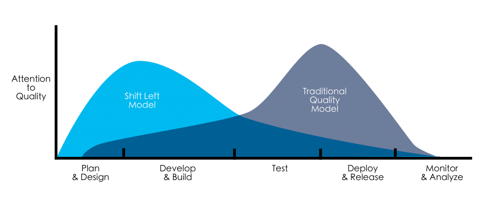

- TOC
{:toc}

## Overview
The Scalability group is responsible for GitLab at scale, working on the highest priority scaling items related to our SaaS platforms. The group works in close coordination with **Reliability Engineering** teams and **Platform Engineering** teams. We support other Engineering teams by sharing data and techniques so they can become better at scalability as well.

As its name implies, the Scalability group enhances the **availability**, **reliability** and performance of GitLab's SaaS platforms by observing the application's capabilities to operate at scale.

The **Scalability group** analyzes application performance on GitLab's SaaS platforms, recognizes bottlenecks in service availability, proposes (and develops) short term improvements and develops long term plans that help drive the decisions of other Engineering teams.

## Challenges
<!-- Optional section. What are our constraints? (team size, product maturity, lack of brand, GTM challenges, etc). What are our market/competitive challenges? -->

GitLab teams have a large amount of autonomy and are empowered to work on things that are the most important for their stage and user base. This is great for the development of features, categories and stages, but can create a challenging environment for operating a platform at scale. Since stage teams are empowered to make the changes they need and GitLab operates with a [bias for action](https://handbook.gitlab.com/handbook/values/#bias-for-action), stage teams may decide that a shared implementation does not fit their requirements and end up building their own. This can lead to redundancy, the inability to share and re-use code and ultimately increases the tech debt of GitLab. It is therefore important to balance the overall velocity and scalability of GitLab with individual stage team's desire to ship value to our customers. 

Discoverability is also a significant challenge in the platform space. It is vital that users of platform tools are able to quickly discover and implement shared tools and best practices. If the tools are not flexible, easy to discover and easy to implement, they may hurt feature velocity rather than increase it.

The Scalability group can often become the owner of components and be responsible for maintaining them in an operational sense, for example [Redis](https://gitlab.com/groups/gitlab-com/gl-infra/-/epics/878). This work can shift capacity away from other enabling tools that would make GitLab easier to scale and in an ideal world, scalability would be able to handover tools that allow teams to maintain their own components.

Lastly, considering the image below, Scalability tends to operate on the right hand side of the graph, after changes are deployed to our SaaS platforms. This can mean that our work is reactive in nature and we often treat symptoms of bad health in the platforms instead of root causes. Shifting the scaling concerns left, earlier in the software development lifecycle, will help us to scale our SaaS platforms more efficiently.

Two examples where the Scalability Group has already shifted left is [Error Budgets](https://about.gitlab.com/handbook/engineering/error-budgets/) and [Capacity Planning](https://about.gitlab.com/handbook/engineering/infrastructure/capacity-planning/).

## 1-Year Plan

<!-- Describe key themes, projects, and/or features planned over the next year. Also highlight what we will not be doing in the next year -->
Over FY 24, we’ve identified 4 key themes that will help to drive value for GitLab and help us scale to millions of users. 

<!-- May need updating as more AI initiatives come in -->

#### Support the Launch of Code Suggestions

As part of GitLab’s commitment to continue to (win against GitHub with AI)[https://about.gitlab.com/company/yearlies/#fy24-yearlies], we have rapidly iterated on and experimented with a new cohort of AI enabled features that make up part of our AI enabled DevSecOps platform. As domain experts in infrastructure and operating a platform that scales to millions of users, the Scalability group have been core enablers of this flagship feature and will continue to work to ensure that we are able to scale safely across our SaaS platforms.

#### Launch Runway and Scale our Experimentation 

As part of the rapid experimentation process that Scalability is enabling for AI features across our DevSecOps platform, we have discovered a number of areas where there is specific room for improvement. Our current setup allows us to experiment with manual support, however we can increase efficiency by building a framework and platform that makes it easy for GitLab teams to self serve and experiment in a safe and performant way. This will critically enable the development of AI features in the short term, but should bring benefit to all other areas of feature development once we’re up and running. The platform is called Runway and you can see the progress in the [Runway Epic](https://gitlab.com/groups/gitlab-com/gl-infra/-/epics/969)

### Horizontal Scalability

Resource saturation is one of the [four golden signals](https://www.gremlin.com/blog/four-golden-signals) which contribute directly to the user experience of a service or application. Reaching high saturation levels can cause the most severe problems for SaaS services including degraded services, downtime and even complete outages. One of the best ways that we can prevent saturation issues is through horizontal scaling of our services and we're making this a priority.

#### Transition Redis to a low-touch service

In FY23, the Scalability Group focused on making sure that none of our Redis instances are at risk of saturation. In FY24, we need to achieve a lower-touch model, similar to what we achieved with Sidekiq. When we have defined a scaling strategy per instance and automated as many of the scaling options as possible, we will have a clearer path to defining what is required for long-term ownership of this service.

From a practical perspective, this means:

- Setting and achieving a set of key saturation targets (eg, cpu, memory) per cluster
- Determining which scaling options are suitable for each instance
- Automating scaling activities for Redis

### Scalability Advocacy and Facilitation

#### Scale Software development practices

As identified in the [challenges](#challenges), one of the patterns that Scalability often fall into is the treatment of symptoms that affect the availability and performance of GitLab.com. At present, we are able to do this successfully, but there is a limit to how scalable this approach is and we will likely discover that limit suddenly. In addition, [GitLab's forecasted user growth](https://app.periscopedata.com/app/gitlab/808384/GitLab.com-predicted-growth?widget=10777071&udv=1549837) (internal only) gives us an indication of how much we expect the demands of the platform to increase over the coming years. In order to prevent reaching the limit of our current scaling approach, we must invest in identifying and treating the root causes and emerging patterns that cause GitLab to be difficult to scale. In doing this, we can operate GitLab at greater scale, more efficiently and increase the effectiveness of our group.

We've identified [Application limits](https://gitlab.com/groups/gitlab-com/gl-infra/-/epics/1020) as a good first step to start scaling our development practices. We've already created a [next rate limting architecture blueprint](https://docs.gitlab.com/ee/architecture/blueprints/rate_limiting/) and now need to create the tools that GitLab team members can use.

#### Reinvigorate the Service Maturity Model

As part of the feature development lifecycle at GitLab, we iterate with [Minimum Viable Changes](https://handbook.gitlab.com/handbook/values/#minimal-viable-change-mvc) and feature maturity grows as we iterate. As an example, an experimental feature may only have basic instrumentation so that we can understand any serious issues that arise. As [features mature](/handbook/product/gitlab-the-product/#experiment-beta-ga) the requirements for instrumentation and operating at scale increase. To that end we have created the [Service Maturity Model](/handbook/engineering/infrastructure/service-maturity-model/) which describes the level of maturity of each service within GitLab. As services mature further and implement more of the requirements set out in the Service Maturity Model, we are able to offer them things like service health and golden metrics dashboards. 

We are working to grow the maturity of all services so that we have more insight into our platforms and can run GitLab more efficiently at scale. Next up we'd like to:

- Formally own [the Service Catalog](https://gitlab.com/gitlab-com/runbooks/-/blob/10ad96cf73c0e37f6b5e793092478abf38df707c/services/service-catalog.yml) and refresh it to match current needs
- Create definitions for service criticality and maturity
- Ensure that mature services include usage information per stage group, inclusion in the Error Budget, and scaling information
- Create advocates that will champion the benefits of improving the maturity of their service

#### Make Error Budgets more complete

Currently, Error Budgets at GitLab cover a number of things like Rails endpoints, Sidekiq errors and other application components. However, they do not cover all of the components that a category or stage may use as part of their features. Key items that still need to be incorporated into error budgets include GraphQL, Puma and Database issues. 

To help teams understand how complete their error budget indicators are, we are establishing a [performance indicator for Error Budgets](https://gitlab.com/groups/gitlab-com/gl-infra/-/epics/880). This includes a score for the "completeness" of the Error Budget data which is explained in the linked epic. This will help us to track down the pieces missing from error budget calculations and choose which missing pieces we include first.

#### Expand our domain to include other SaaS Platforms

As [GitLab Dedicated is now generally available](/blog/2023/06/15/gitlab-dedicated-available/), GitLab offers a second [SaaS Platform](/direction/saas-platforms/) beside GitLab.com. Dedicated opens up a new market segment for customers with single-tenant need. It is vital that we are able to tailor the scale of instances for the best UX per customer as well as operate many instances of GitLab Dedicated at scale so that GitLab can operate efficiently.

Throughout FY24, we need to provide help to GitLab Dedicated teams to ensure that individual tenant SLA's are consistently met, and offer our expertise in creating a set of views that allow the team to quickly identify operational bottlenecks.

### Eliminating Toil

#### Adjust the capacity planning process to more closely model that of the Error Budgets

The Scalability Group has been responsible for the infrastructure capacity planning process since FY23. We improved the process to make it simpler to operate, but there is still a large amount of manual intervention required by the Scalability Group. We are working to reduce the amount of human touches that are required to run this process and make notifications and alerts more actionable. This enables us to increase our efficiency and focus SRE time where it is most needed.

First steps may include:

- Establishing service owners and ownership models and including this in the Service Catalog
- Automated routing of warnings to service owners
- Determining the best way to support owners and follow up on overdue warnings

### A note on 'keeping the lights on'

As part of the Scalability Group’s responsibility to scale GitLab.com, there is a significant amount of operational load on the team. We regularly swarm around issues and production incidents, helping teams to quickly identify, root cause and solve GitLab.com problems. This work will typically be prioritized ahead of any project work to ensure that gitlab.com customers are not disrupted.

### What we're not doing

We’re not working on an Internal Developer portal right now, although it could be on the cards in the future. We’re focused on building our internal suite of tools and frameworks and presenting them in a [Thinnest Viable Platform](https://teamtopologies.com/key-concepts-content/what-is-a-thinnest-viable-platform-tvp), before we spend time perfecting the single pane of glass.

We are not working on Infrastructure Cost Data as this was deprioritized.

## 3-Year Strategy

<!-- Where will the product be in 3 years? How will the customer's life/workflow be different in 3 years as a result of our product? -->

One of our core focuses is providing a paved road for our developers. This will probably look like suites of tools, frameworks and technologies as well as documentation and references. By doing this, we aim to increase Developer Experience (DX) at GitLab through scaling our software development practices. We’ll partner closely with our [Engineering productivity team](/handbook/engineering/quality/engineering-productivity/) to help measure and investigate how well we’re solving the problem and where/if we need to pivot.

As a Platform team within GitLab, one of the main ways we can drive value and efficiency is by scaling how we build and operate GitLab. A core responsibility of the Scalability Group is scaling GitLab SaaS Platforms to millions of users. The best place to ensure that we can scale to that level is at the start of the feature development lifecycle, by taking a number of scalability concerns (logging, monitoring, observability, horizontal/vertical scale) and [shifting those left](https://devopedia.org/shift-left), earlier in the software development process. Product teams should be able to [self serve](/direction/saas-platforms/#move-towards-self-service-frameworks) so that they can focus their efforts on the feature implementation whilst ensuring that scalability concerns are built into their features from the start.

Alongside this, we aim to provide an interface where GitLab team members can discover vital information about their service(s)' health, key infrastructure performance indicators and other information that will contribute to the decision making process in feature development. An early MVC of this is the [Stage Groups Index](https://gitlab-com.gitlab.io/gl-infra/platform/stage-groups-index/) (internal only), which contains Error budgets, golden metrics and database table usage information for stage groups to consume.

All of this should culminate in a [Thinnest Viable Platform](https://teamtopologies.com/key-concepts-content/what-is-a-thinnest-viable-platform-tvp), composed of atomic tools and solutions, which acts as a single pane of glass for GitLab team members, reducing cognitive load and increasing discoverability & code re-use across GitLab.

Here’s a link to our [Thinnest Viable Platform Epic](https://gitlab.com/groups/gitlab-com/gl-infra/-/epics/989), where you can see what we’re planning next.

## Stages and Categories
<!-- Provide brief descriptions of stage + category direction, along with links to supporting direction pages -->

- [Error Budgets](/handbook/engineering/error-budgets/)
- [Infrastructure Cost Data](/direction/saas-platforms/cost-data)
- [Capacity Planning](/handbook/engineering/infrastructure/capacity-planning/) 
- Redis 
- Rate Limiting Framework

## What's Next

- [Application Limits](https://gitlab.com/groups/gitlab-com/gl-infra/-/epics/1020)
- [Runway](https://gitlab.com/groups/gitlab-com/gl-infra/-/epics/969)
- [Infrastructure Capacity Planning for Dedicated](https://gitlab.com/groups/gitlab-com/gl-infra/-/epics/928)
- [Enhance Error Budgets/Usage metrics](https://gitlab.com/groups/gitlab-com/gl-infra/-/epics/763)
- Keep the lights on
- Automatic Dependency Update / remediation - TBC
- Fin Ops

The list above can change and should not be taken as a hard commitment.
For the most up-to-date information about our work, please see our [top level epic](https://gitlab.com/groups/gitlab-com/gl-infra/-/epics/148).
