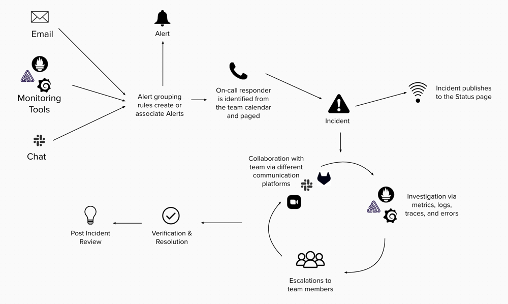

- TOC
{:toc}

## Overview

Downtime is expensive - it costs companies hundreds of thousands of dollars, or more, in a single hour.

While downtime avoidance is preferable, downtime is not avoidable. As such, it is imperative that organizations are geared towards being able to respond to production problems efficiently and effectively. Put another way, organizations need to be resilient.

The majority of investment and focus of the DevOps industry (including GitLab) to date has been on downtime avoidance. There are some entrenched competitors approaching incident management from the perspective of workflows (ServiceNow), or incident notification (Pager Duty, OpsGenie). Despite this, holistic incident management products are lacking resulting in many organizations stitching together point solutions mixed with a healthy dose of DIY. We believe that many organizations are looking for ways to avoid reinventing the wheel on incident management

### Demo
Check out this short video from our engineer Paulina that demos [incident tags](https://gitlab.com/gitlab-org/gitlab/-/issues/373854).

<!-- blank line -->
<figure class="video_container">
  <iframe src="https://www.youtube-nocookie.com/embed/gs0gbRTaD7k" frameborder="0" allowfullscreen="true"> </iframe>
</figure>
<!-- blank line -->

To see past demos take a look at the [Respond Group playlist](https://www.youtube.com/playlist?list=PL05JrBw4t0KoO5WmppV5TduOD9D-IP2p0) or click the link(s) below.
- [August 2022](https://www.youtube.com/watch?v=MIjGyoTh7hQ) - What we've built so far; on-call schedules, escalation policies, alerts, and incidents.
- [September 2022](https://www.youtube.com/watch?v=ResCq5DsjME) - GitLab Incidents as the single source of truth (SSOT).
- [October 2022](https://www.youtube.com/watch?v=l2Larebm1Ic&t=1s) - Important incident metrics and how you will be able to track them in GitLab Incidents.
- [November 2022](https://www.youtube.com/watch?v=zj6sYY7NTIo) - Slack App for Incident Management design and [epic](https://gitlab.com/groups/gitlab-org/-/epics/8545) overview
- [December 2022](https://www.youtube.com/watch?v=Gtdvpk8Pjm4) - A short demo video that highlights our **designs** for our [Post-incident review MVC](https://gitlab.com/groups/gitlab-org/-/epics/9447).

### Vision

GitLab Incident Management helps teams build resiliency in their software and processes against downtime, outages, and other unexpected situations.

We plan to achieve this by:

- Capturing the single source of truth (SSOT) with **[incident timelines](https://gitlab.com/groups/gitlab-org/-/epics/6376)**.
- Continuously improving software and process resiliency through **incident reviews** and **[incident dashboards](https://gitlab.com/groups/gitlab-org/-/epics/3961)**.
- Facilitating planning and coordination through the use **[on-call schedule management](/direction/service-management/on-call_schedule_management/)**.
- Boosting signals and notifying on-call responders through the use of **[alert integration](/direction/service_management/alert_management/)** and **[escalations](https://gitlab.com/groups/gitlab-org/-/epics/4638)**.
- Communicating with customers via **[status pages](https://gitlab.com/groups/gitlab-org/-/epics/2479)**.

We've also created a series of vision items for the category, which are visible in this [issue](https://gitlab.com/gitlab-org/monitor/monitor/-/issues/41). A video walk-through of our vision items is also available on [YouTube](https://www.youtube.com/watch?v=wq-JCueATZQ).

### Challenges

As we invest R&D in building out Incident Management at GitLab, we are faced with the following challenges:

- The market is dominated by incident management companies that have been around for longer. Specific examples are included in the [Competitive Landscape](#competitive-landscape) section.
- We lack brand identification with Enterprise Ops buyers (also mentioned on the [Ops Vision page](https://about.gitlab.com/direction/ops/#challenges))
- Incident management tools typically work in conjunction with other monitoring tools. Having a robust ecosystem of integration with monitoring tools is an expensive investment.

### Opportunities

We are uniquely positioned to take advantage of the following opportunities:

- Colocation of code and incidents significantly reduces context switching and accelerates [MTTR](https://en.wikipedia.org/wiki/Mean_time_to_repair). We can correlate development events such as merge requests or deployments with incidents, shortening the time it takes to find the root cause and automates some of the work required to prepare a timeline of events necessary for Post Incident Reviews
- We are well-practiced in building [boring solutions](/handbook/values/#boring-solutions) and [iteration](/handbook/values/#iteration). This will enable us to quickly produce a simple version of Incident Management "just-good-enough" to displace DIY solutions
- We can uniquely serve the needs of Operations Managers who struggle to answer the question - "Are my teams spending all their time firefighting, or are they proactively managing the health of their applications?"

## Target Audience and Experience

Our current Incident Management tools have been built for users who align with our [Allison (Application Ops)](https://about.gitlab.com/handbook/product/personas/#allison-application-ops) and [Ingrid (Infrastructure Operator)](https://about.gitlab.com/handbook/product/personas/#ingrid-infrastructure-operator) personas. The experience targets DevOps teams at smaller companies where it is common for the engineers to be on-call and responding to alerts for the software that they also write code for. As we mature this category, we will evolve the experience to appeal to and serve the enterprise customer. [Here](https://about.gitlab.com/handbook/engineering/development/ops/monitor/respond/jtbd/) is a list of all jobs to be done (JTBD) for incident management.

# Roadmap

### Now - (next 1-4 milestones)
`GitLab Incidents are the single source of truth (SSOT)`

**_Prioritized Development Work_**
- Incident metrics are a set of standard, quantifiable measurements used to track the incident response process. We are also working on allowing [incident response teams can track timestamps in incidents](https://gitlab.com/gitlab-org/gitlab-design/-/issues/1911)!
- The majority of do it yourself (DIY) users use Slack or similar apps as the main collaboration tool during an incident. We want to make it easy for incident response teams to use Slack _and_ GitLab incident management, ensuring [Slack-to-GitLab workflows are seamless to minimize repetitive, manual work for incident response teams](https://gitlab.com/gitlab-org/gitlab-design/-/issues/1944). For our internal team, we plan to replace [woodhouse](https://gitlab.com/gitlab-com/gl-infra/woodhouse) with a productized Slack integration.
- Every incident is an investment and users want to improve their incident response posture and learn from past incidents.  We're [introducing a post-incident review process so teams can learn from past incidents and better prepare for future, similar events](https://gitlab.com/gitlab-org/gitlab-design/-/issues/1945).

**_How are we tracking success?_**
- Ship [Slack App for Incident Management](https://gitlab.com/groups/gitlab-org/-/epics/8545); measure the number of integrations setup and work on a [go to market (GTM) effort directly with Slack](https://gitlab.com/gitlab-org/gitlab/-/issues/389002).
- Ship [Incident Review](https://gitlab.com/gitlab-org/gitlab-design/-/issues/1945). We will track usage, particularly percentage of incident reviews conducted relative to the number of ~"severity::1"  incidents created.
- Ship [Incident Tags MVC](https://gitlab.com/groups/gitlab-org/-/epics/8741) so users can start measuring important incident metrics.

### Next (next 5-8 milestones)
`On-call incident responders never miss an alert.`
**_Prioritized Development Work_**
- We are working on [ensuring on-call schedule experience is accurate and flexible enough to fit incident response teams' needs](https://gitlab.com/gitlab-org/gitlab-design/-/issues/1903). Sometimes responders need to get their shifts covered; we'll be introducing [scheduled overrides](https://gitlab.com/groups/gitlab-org/-/epics/5311).  Additionally, being on-call during normal working/ business hours isn't the same as being on-call during a Friday evening or weekend; we're introducing the ability for [on-call schedules to allow for specific days](https://gitlab.com/gitlab-org/gitlab/-/issues/355807). 
- Responders need to be automatically notified when an alert is triggered and they want to define _how_ they are contacted/paged.  This will increase their responsiveness to an alert that needs to be triaged.  We will be introducing [paging options](https://gitlab.com/groups/gitlab-org/-/epics/1438) beyond email like a phone call or an SMS text message.  

**_How are we tracking success?_**
- Users subscribe to usage based pricing for on-call schedules (more than 5 pages a month)
- The number of on-call schedules monthly active users increases.
- GitLab On-Call reaches [viable maturity](https://gitlab.com/groups/gitlab-org/-/epics/7026)!

### Future (next 9-12 milestones)
`Alerts can be easily triaged`

**_Prioritized Development Work_**
- We will continue to build more incident management features, making GitLab [alerts](https://docs.gitlab.com/ee/operations/incident_management/alerts.html#alerts) [more robust so teams can quickly and effectively triage them](https://gitlab.com/gitlab-org/gitlab-design/-/issues/1820).
- We will work across stages, ensuring GitLab events that warrant and alert, [like a failed pipeline](https://gitlab.com/gitlab-org/gitlab/-/issues/217770), are surfaced in the [alert list](https://docs.gitlab.com/ee/operations/incident_management/alerts.html#alert-list).

**_Exploratory work to inform future priorities_**
- Explore [incident roles so it's immediately visible who-is-responsible-for-what during an incident.](https://gitlab.com/gitlab-org/gitlab-design/-/issues/1975)
- Determine [how users find out who can help when there is an incident?](https://gitlab.com/gitlab-org/ux-research/-/issues/2156)

**_How are we tracking success?_**
- Through cross stage adoption we see an increase in our Group Monthly Active Users (GMAU).
- GitLab Incident Management reaches [complete maturity](https://gitlab.com/groups/gitlab-org/-/epics/1494)!

### Long Term (2+ years, FY26 and beyond)
`Users come to GitLab for their incident management solution`
- Strong bi-directional product tie-in to other GitLab stages and Monitor categories including, Error Tracking, Tracing, Logging, Metrics, Continuous Verification, Service Catalog and Runbooks.  What could this look like in practice?:
  - Users can see auto-generated incidents directly in their alerting tool.
  - Users can quickly identify what service, code change, or customer is experiencing degraded performance. 
  - Users leverage automation to link past incidents to current incidents, creating merge requests with a proposed solution or pointing engineers on-call to a knowledge base.
  - Users can execute suggested runbooks with the click of a button.
- Users can quantify and show a decrease in mean time to resolve (MTTR).  GitLab takes decreasing MTTR one step further; users are able to demonstrate that they catch more incidents before they happen through continuous verification, chaos engineering, and capacity forecasting.

## Workflow

Incident Management is a broad category. The following diagram explains all functionality that is currently within scope for our vision of the category.

### Maturity Plan

We are currently working to mature the **Incident Management** category from `viable` to `complete`. Definitions of these maturity levels can be found on [GitLab's Maturity page](https://about.gitlab.com/direction/maturity/). The following epics group the functionality we have planned to mature Incident Management.
- [Complete](https://gitlab.com/groups/gitlab-org/-/epics/1494)
- [Lovable](https://gitlab.com/groups/gitlab-org/-/epics/1539)

### What is Next & Why?

- [Introduce incident management workflow to GitLab Slack App](https://gitlab.com/groups/gitlab-org/-/epics/8545) to ensure Slack-to-GitLab workflows are seamless to minimize repetitive, manual work for incident response teams.
- [Incident Tags MVC](https://gitlab.com/groups/gitlab-org/-/epics/8741) to start capturing relevant incident timestamps to begin measuring important inincidentcient metrics like mean time to resolve (MTTR).

### Dogfooding Plan

We are actively [dogfooding](https://about.gitlab.com/handbook/product/product-processes/#when-do-we-dogfood) Incident Management features with the [Infrastructure team](https://about.gitlab.com/handbook/engineering/infrastructure/team/). Today, the Infrastructure team relies partially on PagerDuty to maintain GitLab.com and the other services they are responsible for. Ultimately the joint goal of the Infrastructure team and the Respond group is for the Infrastructure team to rely soley on GitLab Incident Management. Our plan to achieve this goal is as follows:

1. Prioritize new functionality based on the [gap analysis](https://gitlab.com/gitlab-org/monitor/health/-/issues/36)
1. Meet with the Infrastructure team on a monthly cadence to gather feedback and incorporate changes into upcoming milestones.
1. Incrementally dogfood new features via simulation days ([example](https://gitlab.com/gitlab-org/gitlab/-/issues/231518)) to gather immediate feedback on for improvements
1. Begin a full migration once we have completed filling in the gap analysis - view migration plan [here](https://gitlab.com/groups/gitlab-com/gl-infra/-/epics/322)

#### Incident Management features the Infrastructure team is currently Dogfooding

<b>Feature List</b>

<table>
    <tr>
        <td>General Feature</td>
        <td>Specific Feature</td>
        <td>Dogfooding?</td>
        <td>Example</td>
        <td>Feature needs 'x' to dogfood</td>
    </tr>
    <tr>
        <td><b>Incidents</b></td>
        <td>
<a href="https://docs.gitlab.com/ee/operations/incident_management/incidents.html">Incident issue type</a>

        </td>
        <td>✅</td>
        <td></td>
        <td></td>
    </tr>
    <tr>
        <td></td>
        <td>
<a href="https://docs.gitlab.com/ee/operations/incident_management/manage_incidents.html#create-an-incident">Creating incidents manually</a>

        </td>
        <td>✅</td>
        <td></td>
        <td></td>
    </tr>
    <tr>
        <td></td>
        <td>
<a href="https://docs.gitlab.com/ee/operations/incident_management/manage_incidents.html#automatically-when-an-alert-is-triggered">Creating incidents automatically</a>

        </td>
        <td>✅</td>
        <td>
<a href="https://gitlab.com/gitlab-com/gl-infra/production/-/issues/6159">Sample incident</a>
 created via ops.gitlab.net</td>
        <td></td>
    </tr>
    <tr>
        <td></td>
        <td>
<a href="https://docs.gitlab.com/ee/operations/incident_management/incidents.html#timeline-events">Incident timelines</a>

        </td>
        <td>✅</td>
        <td></td>
        <td></td>
    </tr>
    <tr>
        <td></td>
        <td>
<a href="https://docs.gitlab.com/ee/operations/incident_management/linked_resources.html">Linked resources</a>

        </td>
        <td>🔴</td>
        <td>TBD, just released, 
<a href="https://gitlab.com/gitlab-org/gitlab/-/issues/370133">Dogfood issue</a>
</td>
        <td></td>
    </tr>
    <tr>
        <td></td>
        <td>
<a href="https://docs.gitlab.com/ee/operations/incident_management/manage_incidents.html#using-the-pagerduty-webhook">Creating incidents via the PagerDuty webhook</a>
</td>
        <td>🔴</td>
        <td></td>
        <td></td>
    </tr>
    <tr>
        <td></td>
        <td>
<a href="https://docs.gitlab.com/ee/operations/incident_management/incidents.html#incident-list">Incident list</a>
</td>
        <td>🔴</td>
        <td></td>
        <td>Labels need to be included on the incident list.</td>
    </tr>
    <tr>
        <td></td>
        <td>
<a href="https://docs.gitlab.com/ee/operations/incident_management/incidents.html#metrics">Metrics tab</a>
</td>
        <td>🔴</td>
        <td></td>
        <td>There isn't a working integration with our observability vendor. Metrics are added as screen shots 
<a href="https://gitlab.com/gitlab-com/gl-infra/production/-/issues/6159#note_808876372">(example)</a>
 to the incident.</td>
    </tr>
    <tr>
        <td></td>
        <td>
<a href="https://docs.gitlab.com/ee/operations/incident_management/incidents.html#alert-details">Alert details tab</a>
</td>
        <td>🔴</td>
        <td></td>
        <td>Not currently dogfooding GitLab alerts</td>
    </tr>
    <tr>
        <td></td>
        <td>
<a href="https://docs.gitlab.com/ee/operations/incident_management/incidents.html#service-level-agreement-countdown-timer">Service Level Agreement countdown timer</a>
</td>
        <td>🔴</td>
        <td></td>
        <td>SLAs aren't based on a per incident basis</td>
    </tr>
    <tr>
        <td><b>Alerts</b></td>
        <td>
<a href="https://docs.gitlab.com/ee/operations/incident_management/alerts.html">GitLab Alerts</a>

</td>
        <td>🔴</td>
        <td></td>
        <td>Alert improvments are noted 
<a href="https://gitlab.com/gitlab-org/monitor/respond/-/issues/149#opportunities-for-alert-improvements">here</a>
</td>
    </tr>
    <tr>
        <td></td>
        <td>
<a href="https://docs.gitlab.com/ee/operations/incident_management/alerts.html#alert-list">Alert list</a>
</td>
        <td>🔴</td>
        <td></td>
        <td>Dependent on dogfooding alerts.</td>
    </tr>
    <tr>
        <td></td>
        <td>
<a href="https://docs.gitlab.com/ee/operations/incident_management/alerts.html#alert-details-tab">Alert details tab</a>
</td>
        <td>🔴</td>
        <td></td>
        <td>Dependent on dogfooding alerts.</td>
    </tr>
    <tr>
        <td></td>
        <td>
<a href="https://docs.gitlab.com/ee/operations/incident_management/alerts.html#metrics-tab">Metrics tab</a>
</td>
        <td>🔴</td>
        <td></td>
        <td>Dependent on dogfooding alerts.</td>
    </tr>
    <tr>
        <td></td>
        <td>
<a href="https://docs.gitlab.com/ee/operations/incident_management/integrations.html#http-endpoints">HTTP endpoints</a>
</td>
        <td>🔴</td>
        <td></td>
        <td>Mapping a complex payload to the custom mapping was cumbersome. Alerts showed a new alert when the payload changed.</td>
    </tr>
    <tr>
        <td></td>
        <td>
<a href="https://docs.gitlab.com/ee/operations/metrics/alerts.html#external-prometheus-instances">Prometheus integration</a>

        </td>
        <td>🔴</td>
        <td></td>
        <td>Right now Pager Duty is the single source of truth for alerts. There is not any value, beyond associating GitLab Alerts to GitLab Incidents.</td>
    </tr>
    <tr>
        <td></td>
        <td>
<a href="https://docs.gitlab.com/ee/operations/metrics/alerts.html#external-prometheus-instances">Grouping of identical alerts</a>

        </td>
        <td>🔴</td>
        <td></td>
        <td>Dependent on dogfooding alerts. Looking for the ability to manually add similar alerts to the same incident.</td>
    </tr>
</table>

### Marketing & Sales Enablement

Marketing and Sales Enablement material can be found [here](https://about.gitlab.com/handbook/marketing/brand-and-product-marketing/product-and-solution-marketing/usecase-gtm/incident-management/).

### Pricing

Features in the Incident Management category have been placed in tiers based on GitLab's [Buyer Based Tiering](https://about.gitlab.com/company/pricing/#buyer-based-tiering-clarification) strategy. The following pricing plan represents existing and future features.

#### Incidents

| Functionality| Free | Premium | Ultimate |
| ------------ | ---- | ------- | -------- |
|[Manual incident creation](https://docs.gitlab.com/ee/operations/incident_management/manage_incidents.html#from-the-incidents-list)|✅ |✅ |✅|
|Incident creation based on limited criteria (e.g. integration or severity)||✅ |✅ |
|[Incident timelines](https://docs.gitlab.com/ee/operations/incident_management/incident_timeline_events.html)|✅ |✅ |✅|
|Incident tags|✅ |✅ |✅|
|[Linked resources](https://docs.gitlab.com/ee/operations/incident_management/linked_resources.html)||✅ |✅|
|Incident Reviews||✅ |✅|
|[Slack app for incident management](https://docs.gitlab.com/ee/operations/incident_management/slack.html)|||✅|
|Incident dashboards|||✅|

#### Alerts

| Functionality| Free | Premium | Ultimate |
| ------------ | ---- | ------- | -------- |
|One [Generic HTTP Endpoint](https://docs.gitlab.com/ee/operations/incident_management/alert_integrations.html#generic-http-endpoint)| ✅ |✅ |✅|
|Internal GitLab Alerts|✅|✅ |✅|
|One [Generic HTTP Endpoint](https://docs.gitlab.com/ee/operations/incident_management/alert_integrations.html#generic-http-endpoint)| ✅ |✅ |✅|
|[Email integration](https://gitlab.com/groups/gitlab-org/-/epics/4056)| |✅ |✅|
|Multiple email endpoints||✅ |✅|
|[External Prometheus integration](https://docs.gitlab.com/ee/operations/incident_management/alert_integrations.html#external-prometheus-integration)|✅  |✅ |✅|
|[Custom mapping for alert formats to endpoints](https://gitlab.com/groups/gitlab-org/-/epics/4443)||✅ |✅|
|Special bi-directional out of the box integrations with popular monitoring tools|||✅|

## Competitive Landscape

| Name of Competitor | Year Founded | Relative Links|
| ------------------ | ------------ |---------------|
| Atlassian Opsgenie | 2012 | [Website Link](https://www.opsgenie.com/) |
| AWS Incident Manager | 2021 | [Website Link](https://docs.aws.amazon.com/incident-manager/latest/userguide/what-is-incident-manager.html) |
| Grafana OnCall (Previously Amixr) | 2018, acquired by Grafana in 2021 | [Website Link](https://www.opsgenie.com/)   [Competitive Analysis](https://gitlab.com/gitlab-com/Product/-/issues/3380) |
| Jeli | 2019 | [Website Link](https://www.jeli.io/#what-is-it) |
| PagerDuty | 2009 | [Website Link](https://www.pagerduty.com/) |
| Rootly | 2020 | [Website Link](https://rootly.io/)   [Competitive Analysis](https://gitlab.com/gitlab-com/Product/-/issues/2943) |
| ServiceNOW | 2003 | [Website Link](https://www.servicenow.com/products/incident-management.html) |
| Splunk On-Call (Previously VictorOps) | 2021, acquired by Splunk in 2018 | [Website Link](https://www.splunk.com/en_us/software/splunk-on-call.html) |
| XMatters | 2000 | [Website Link](https://www.xmatters.com/use-cases/major-incident-management-mim/) |
| FireHydrant | 2018 | [Website Link](https://firehydrant.com/)   [Competitive Analysis](https://gitlab.com/gitlab-org/monitor/respond/-/issues/117) |
| Blameless | 2017 | [Website Link](https://blameless.com/)   [Competitive Analysis](https://gitlab.com/gitlab-org/monitor/respond/-/issues/117) |

## Analyst Landscape

Analyst firms such Gartner and 451 have recently published articles on the rising prevalence of automation in incident response workflows.

### Gartner

Gartner's recent research study titled **Automate Incident Response to Enhance Incident management**, focuses on the importance of leveling up manual incident response processes with automation: "Organizations targeting best-in-class incident management must address the manual processes and collaboration challenges between teams.” They go on to outline some of their key findings which highlight that “I&O organizations are looking to enhance incident response by focusing on automation, third-party integration, stakeholder management and improved detection response feedback loops.”

Their recommendations include the following:

- "Invest in a centralized on-call management system and automate incident response workflows with wide integrations that create a holistic incident response management solution."
- "Integrate monitoring solutions and Service Desk systems with bidirectional synchronization to incident response systems, which keeps the incident status synchronized across systems."
- "Leverage automation to extend incident response capabilities that can integrate with DevOps toolchain monitoring."
- "Improve incident communication and collaboration by integrating incident workflow processes with ChatOps tools like Slack or Microsoft Teams."

_Gartner, Automate Incident Response to Enhance Incident management, By: Venkat Rayapudi & Steve White, Published 18 September 2020_

Competitors (listed above in [competitive landscape](#competitive_landscape)) enable the automation of these processes to different extents. Automattion functionality is typically offered with higher pricing tiers across the board. In order to take advantage of these automation features, companies must invest significant time in the configuration and fine-tuning of systems and processes.

In the near term, GitLab is positioned to enable Gartner’s recommendations for a best in-class incident management platform via the centralization of [on-call schedule management](https://gitlab.com/groups/gitlab-org/-/epics/3960) to enable the automatic routing of alerts to the right responders at the right time.

### 451 Research

451 Research published an article on the acquisition of Rundeck by PagerDuty in September 2020. Read more about this on Rundecks [website](https://www.rundeck.com/pagerduty). This was a strategic move to meet the demands of the enterprise for more automation in incident response.

GitLab has plans to investigate using Rundeck for Runbooks via [Runbooks - Rundeck Validation](https://gitlab.com/gitlab-org/gitlab/-/issues/36655), this will be interesting opportunity to connect the PagerDuty lifecycle into GitLab Runbooks and Monitoring capabilities.

There is an existing landscape of comparable tools and even "ServiceNow and xMatters have orchestration engines that can be deployed to build workflows across tools, but they aren't typically extensively used to execute remediations." VictorOps (owned by Splunk) and OpsGenie (owned by Atlassian) are other similar tools with visions like PagerDuty.
